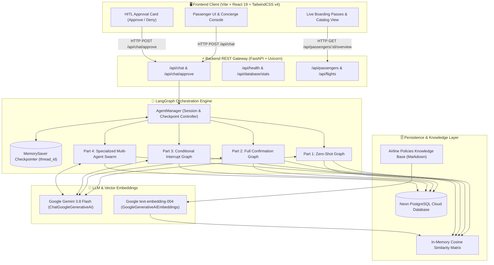
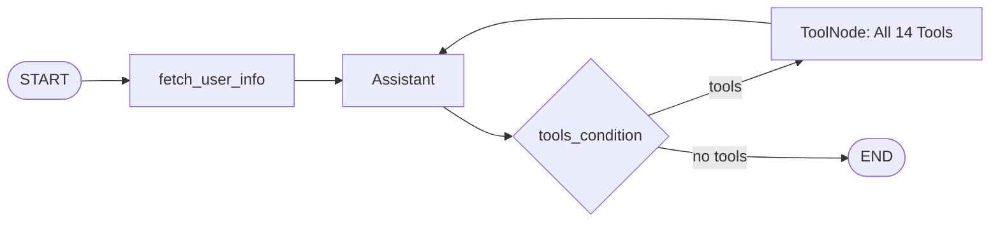
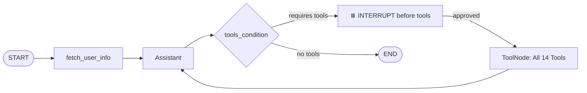
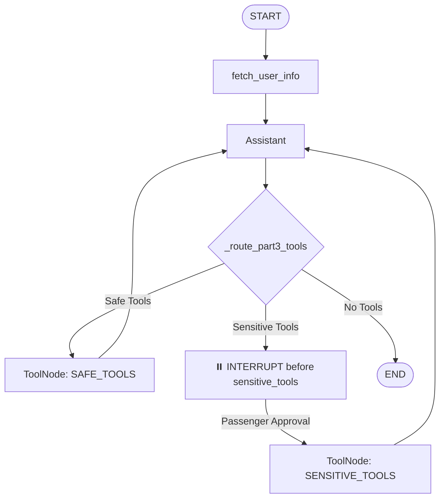
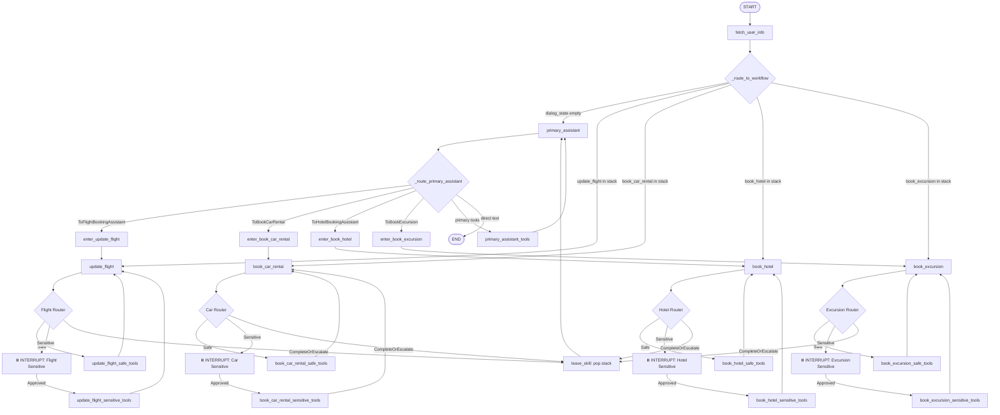
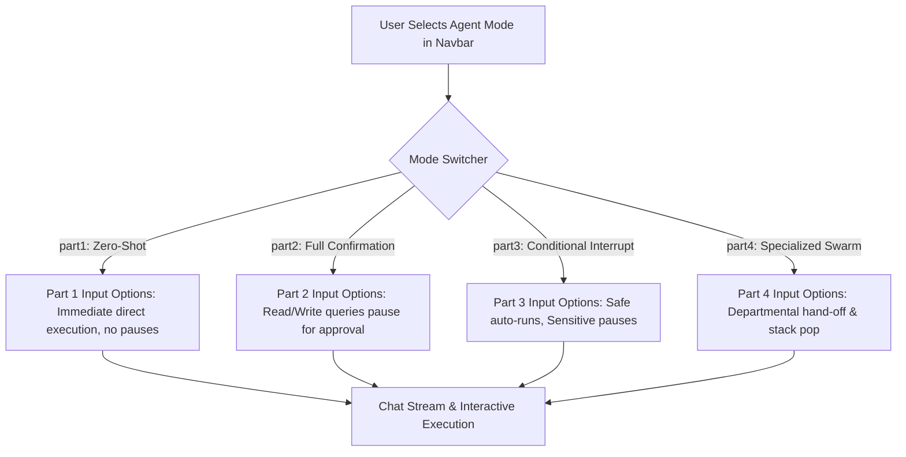

# 🏛️ AeroAssist System Architecture (`architecher.md`)

This architectural document provides an in-depth blueprint of the **AeroAssist** enterprise airline customer support system. It details the multi-agent graph mechanics, state management, Human-in-the-Loop (HITL) interrupt pipelines, PostgreSQL relational data layer, RAG knowledge retrieval, and React frontend integration.

---

## 1. High-Level System Architecture



---

## 2. Multi-Tier LangGraph Agent Architectures

AeroAssist incorporates 4 distinct customer support architectures compiled with **LangGraph**:

### Part 1: Zero-Shot Agent (Unconstrained Direct Execution)
In Part 1, all tools (both safe queries and sensitive mutations) execute immediately upon model invocation.


---

### Part 2: Full Confirmation Agent (Every Tool Pauses)
In Part 2, the graph defines `interrupt_before=["tools"]`. The system halts before executing *any* tool (even read-only searches), requiring explicit human confirmation.


---

### Part 3: Conditional Interrupt Agent (Safe vs Sensitive Bifurcation)
Part 3 dynamically inspects the proposed tool calls. Read-only search and lookup tools execute in real time without human latency, while sensitive write operations pause at graph interrupts.


---

### Part 4: Specialized Multi-Agent Swarm (Hierarchical Delegation)
Part 4 is the pinnacle enterprise multi-agent architecture. It organizes domain tasks into specialized mini-agents governed by a central **Primary Assistant** router with a dynamic dialog stack.



---

## 3. Human-in-the-Loop (HITL) Execution Engine

### Interruption Triggering
When the graph encounters an interrupt-configured node:
1. `graph.stream(..., stream_mode="values")` yields messages up to the AI's tool call.
2. The runtime freezes execution immediately prior to running the sensitive node.
3. `graph.get_state(cfg).next` holds the name of the pending node (e.g. `['update_flight_sensitive_tools']`).
4. `AgentManager._format_agent_output()` extracts the proposed tool call and arguments, generates a unique `action_id`, and stores an entry in the `pending_actions` table.
5. The API response returns `{"status": "requires_approval", "action_id": "...", "actions": [...]}`.

### Resumption via Passenger Approval
When the passenger clicks **Approve**:
```python
# graph.stream with None input continues from current checkpoint
events = list(graph.stream(None, cfg, stream_mode="values"))
DatabaseService.update_pending_action_status(action_id, "approved")
```

### Resumption via Passenger Denial
When the passenger clicks **Deny**:
```python
# Inject synthetic ToolMessage into the frozen tool node
graph.update_state(
    cfg,
    {
        "messages": [
            ToolMessage(
                tool_call_id=tc["id"],
                content=f"Action denied by passenger. Reason: '{denial_reason}'. Continue assisting.",
            )
            for tc in last_ai.tool_calls
        ]
    },
    as_node=pending_node,
)
DatabaseService.update_pending_action_status(action_id, "denied")
# Resume graph execution so the agent can propose alternative options
events = list(graph.stream(None, cfg, stream_mode="values"))
```

---

## 4. Neon PostgreSQL Relational Schema

```
                               ┌───────────────────┐
                               │   airports_data   │
                               ├───────────────────┤
                               │ airport_code (PK) │
                               │ airport_name      │
                               │ city, timezone    │
                               └─────────┬─────────┘
                                         │
                                         ▼
┌───────────────────┐          ┌───────────────────┐
│  aircrafts_data   │          │      flights      │
├───────────────────┤          ├───────────────────┤
│ aircraft_code(PK) │◄─────────┤ flight_id (PK)    │
│ model, range      │          │ departure_airport │
└───────────────────┘          │ arrival_airport   │
                               │ scheduled_dep/arr │
                               └─────────┬─────────┘
                                         │
                                         ▼
┌───────────────────┐          ┌───────────────────┐
│     bookings      │          │  ticket_flights   │
├───────────────────┤          ├───────────────────┤
│ book_ref (PK)     │◄─────────┤ ticket_no (FK)    │
│ book_date, total  │          │ flight_id (FK)    │
└─────────┬─────────┘          │ fare_conditions   │
          │                    └─────────┬─────────┘
          ▼                              │
┌───────────────────┐                    ▼
│      tickets      │          ┌───────────────────┐
├───────────────────┤          │  boarding_passes  │
│ ticket_no (PK)    │◄─────────┤ ticket_no (FK)    │
│ passenger_id      │          │ flight_id (FK)    │
│ passenger_name    │          │ seat_no, boarding │
└───────────────────┘          └───────────────────┘

┌───────────────────┐ ┌───────────────────┐ ┌────────────────────────┐
│    car_rentals    │ │      hotels       │ │  trip_recommendations  │
├───────────────────┤ ├───────────────────┤ ├────────────────────────┤
│ rental_id (PK)    │ │ hotel_id (PK)     │ │ recommendation_id (PK) │
│ company, location │ │ name, location    │ │ title, location        │
│ booked, passenger │ │ booked, passenger │ │ booked, passenger_id   │
└───────────────────┘ └───────────────────┘ └────────────────────────┘
```

---

## 5. Policy Knowledge Base (RAG) Architecture

1. **Document Ingestion**:
   - `backend/app/rag/policies.md` contains markdown sections detailing flight cancellations, baggage limits, flight change policies, car rental terms, and hotel policies.
2. **Embedding & Cosine Retrieval**:
   - `PolicyRetriever` uses `GoogleGenerativeAIEmbeddings(model="text-embedding-004")` to generate 768-dimensional vectors.
   - Vectors are normalized into a unit matrix: $\hat{v} = v / \|v\|$.
   - Search query $q$ is embedded and projected: $\text{scores} = M \cdot \hat{q}$.
3. **Keyword Fallback**:
   - If the API key is not supplied or offline, the retriever transparently falls back to token overlap scoring: $\frac{|W_q \cap W_c|}{\max(|W_q|, 1)}$.

---

## 6. Directory Layout & Organization

```
customer_support_app/
├── main.py                     # Root ASGI & CLI launcher
├── README.md                   # Fullstack project documentation
├── agents.md                   # Detailed agent specifications & safety matrix
├── architecher.md              # Complete system architecture specification
├── .gitignore                  # Git ignore rules
│
├── backend/                    # Python Backend
│   ├── run.py                  # Direct runner script
│   ├── requirements.txt        # Backend dependencies
│   ├── __init__.py             # Clean top-level package exports
│   ├── app/
│   │   ├── main.py             # FastAPI application instance & CORS
│   │   ├── routes.py           # REST endpoints
│   │   ├── config.py           # Settings, DB URLs, Gemini factory
│   │   ├── db.py               # DatabaseService & connection pooler
│   │   ├── agents/
│   │   │   ├── graph.py        # LangGraph StateGraphs (Parts 1 - 4)
│   │   │   ├── manager.py      # Session orchestrator & approval handler
│   │   │   ├── prompts.py      # System prompts for all agents
│   │   │   ├── tools.py        # 14 LangChain database tools
│   │   │   └── delegation.py   # Pydantic delegation schemas
│   │   ├── rag/
│   │   │   ├── retriever.py    # PolicyRetriever & vector similarity
│   │   │   └── policies.md     # Airline policies markdown knowledge base
│   │   └── scripts/
│   │       └── seed.py         # Schema migration & sample data populator
│   └── tests/
│       └── test_backend.py     # 14 Unit and integration test cases
│
└── frontend/                   # React 19 Frontend
    ├── index.html              # HTML5 entrypoint
    ├── vite.config.ts          # Vite build & backend proxy (/api -> :5000)
    ├── package.json            # Node dependencies
    └── src/
        ├── App.tsx             # Root dual-column layout
        ├── api.ts              # Typed backend API client
        ├── types.ts            # Data models & interfaces
        ├── index.css           # TailwindCSS v4 theme tokens
        └── components/
            ├── Navbar.tsx          # Passenger selector & agent mode picker
            ├── ChatPanel.tsx       # Message thread & approval action cards
            ├── DashboardPanel.tsx  # Boarding passes & active bookings
            └── DatabaseModal.tsx   # Neon DB inspector & re-seeder
```

---

## 7. Mode-Specific Input Architecture & User Interaction Options

To evaluate the operational differences across the 4 LangGraph architectures, the UI and API dynamically adapt the input options and starter presets:



| Mode ID | Architecture Type | Input Categories | Purpose in Demonstrating System |
| :--- | :--- | :--- | :--- |
| `part1` | Zero-Shot Agent | `[Instant Read]`, `[Direct Ticket Change]`, `[Policy RAG]`, `[Direct Booking]` | Demonstrates unconstrained execution where even ticket changes commit without pausing. |
| `part2` | Full Confirmation Agent | `[Read Query Pauses]`, `[Policy Read Pauses]`, `[Search Pauses]`, `[Sensitive Mod Pauses]` | Demonstrates total human oversight where the graph halts before reading or writing data. |
| `part3` | Conditional Interrupt | `[Safe Read (Auto)]`, `[Safe Policy (Auto)]`, `[Sensitive Re-book (HITL)]`, `[Sensitive Cancel (HITL)]` | Demonstrates optimal production balance: read queries run instantly; financial/ticket writes pause for authorization. |
| `part4` | Specialized Multi-Agent Swarm | `[Flight Specialist]`, `[Car Specialist]`, `[Hotel Specialist]`, `[Excursion Specialist]`, `[Escalate / Pop Stack]` | Demonstrates intent routing across domain specialists and bidirectional dialog stack transitions. |

